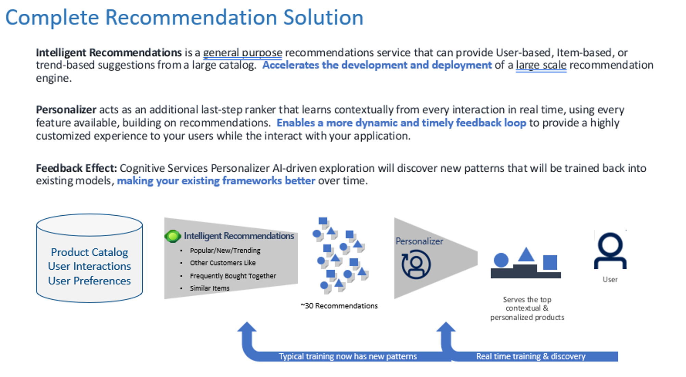

# Retail Recommender

# Introduction

Retailing began with shopkeepers who would welcome in people from the neighborhood and then come to learn their customers’ needs and preferences.

Now in our constantly connected world, devices have become a proxy - but there is still a need to get to know your customers.  Devices provide context, helping us learn what matters to a customer in a particular location and at a particular time. The right message at the right moment is the next level in customer service — it can quickly and easily turn intent into action.

People are constantly looking for product information, deals, local availability and local discounts online — and retailers who aren’t there to supply the right information when people raise their virtual hand will lose out.

The Retail Recommender Solution Accelerator was developed to use intelligent and automated means to provide personalized product recommendations to users based on their purchase history, product selection in the e-commerce channel, or their activity in a physical store.  

For this solution accelerator we will use an example of a grocery store where we want to personalize suggestions to customers for items they might want to add to their basket/order based on their preferences and context but also leveraging learnings from other customers and previous purchases.  

The architecture and methodology extend to other key areas where personalization can enhance customer engagement - email campaigns, discounts/offers, content suggestions, even application configuration/menu options.   Anywhere choices can be made to provide a more customized experience for your customers.

# Architecture

This solution accelerator leverages several cutting edge Azure Services including Intelligent Recommendations, Azure Personalizer and Azure Machine Learning to draw on historical customer data to create customized suggestions quickly and effectively.  

Azure Machine Learning services lets Data Scientists work in their envrionment to ingest and prepare data, configure the AI-as-a-Service offerings (Intelligent Recommendations and Personalizer), orchestrate simulations, analyze results, and evaluate efficacy. 

Intelligent Recommendations is a new innovative AI service providing a codeless experience powered by the same technology that fuels the recommendations made for Xbox, Microsoft 365, and Microsoft Azure. 

Azure Personalizer leverages Reinforcement Learning to fine tune recommendations by ranking and prioritizing, and react in real time to learn what actions drive individual customers to respond.

The architecture is flexible and intended for you to select the services and functionality that meet your business needs.  For example, if you have already built a recommendation engine you could use that with Azure Personalizer to provide hyper-customized recommendations.   If you are just getting started, it might be best to focus on building and integrating the general purpose recommendations provided by Intelligent Recommendations then enhance with Azure Personalizer in the future.  

# Prerequisites

The following steps should be completed prior to working through the Retail Recommender Solution Accelerator.

1. These notebooks are intended to be used with Azure Machine Learning services, follow these instructions [Get Started with Azure Machine Learning Worskapce](https://docs.microsoft.com/en-us/azure/machine-learning/quickstart-create-resources) to set this up.

2.  You will need an Azure Storage Account for managing the files used by the Azure services in the Retail Recommender.  You can use an existing account, or follow these instructions to [Create a storage account](https://docs.microsoft.com/en-us/azure/storage/common/storage-account-create?toc=%2Fazure%2Fstorage%2Fblobs%2Ftoc.json&tabs=azure-portal).  **NOTE:** The default settings and locally-redundant storage are sufficient for running this example, but you might want to modify this based on your organization's data policies.  

# Process Overview

## [1 - Data Preparation](./01_Data_Preparation.ipynb)

This notebook takes example grocery purchase data and transforms it into the file formats used for building a recommender system using the Intelligent Recommendations service. We will assume the orders are collected from a web or mobile application that customers use to order online from a grocery store. The customer interactions we are leveraging in this example is a purchase of an item.

## [2 - Intelligent Recommendations](./02_Recommendations.ipynb)

Intelligent Recommendations is a general purpose service that offers patented capabilities to more effectively drive desired outcomes out of the box such as “shop similar looks,” “shop by description,” “real time,” “session based”, Item based recommendations that can combine User interactions and Item Metadata. Businesses can promote and personalize any content type, such as sellable products, consumable media, documents, videos, and more.  In this notebook you will setup the service, build API calls for the different types of recommendations, and review results.

## [3 - Azure Personalizer](./03_Personalizer.ipynb)

Azure Personalizer leverages Reinforcement Learning to fine tune recommendations by ranking and prioritizing, and react in real time to learn what actions drive individual customers to respond.  This notebook shows how to setup and tune an Azure Personalizer Resource to prioritize the recommendations for individual users based on envinonrmental context and user preferences.

## [4 - Bringing it Together](./04_Personalized_Recommendations.ipynb)

Now that we've created a general purpose recommendation engine with Intelligent Recommendations and a ranking and prioritization system with Azure Personalizer, you will tie it all together to get a customized suggestion.

We will select a customer that is currently doing online grocery shopping and has a few items in their cart already. We will suggest a "Don't forget" item using the top most ranked item from a set of suggested grocery products.